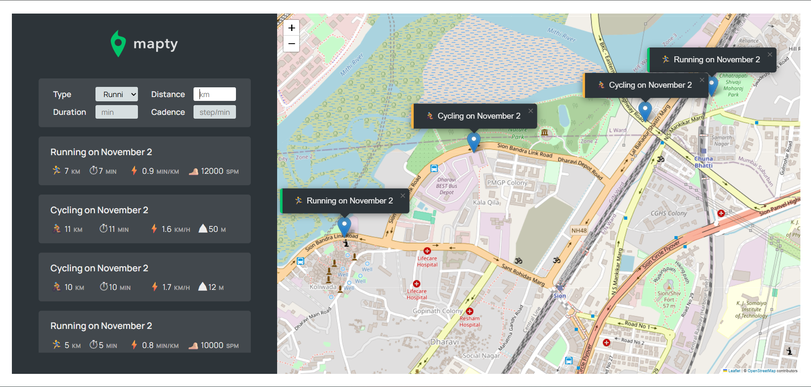

🏃 Workout Tracker App – Notes & Concepts

This JavaScript application allows users to log, view, and map workouts (Running or Cycling) using the Geolocation API and Leaflet.js.
It also stores workouts persistently using Local Storage.

🚀 Features

Map your Running & Cycling workouts using Leaflet (OpenStreetMap)

Record details like distance, duration, cadence, elevation

View all workouts in a list

Click on any workout to move to its map marker

Data stored in Local Storage (persists on reload)

🧱 Architecture Overview

The app is built using Object-Oriented Programming (OOP) principles and modular class design.

Class Structure

Workout → Base class

Running → Extends Workout

Cycling → Extends Workout

App → Handles map loading, user input, and UI updates

🧩 Core JavaScript Concepts Used

1. 🧠 Object-Oriented Programming (OOP)

Encapsulation → Using private fields (#map, #workout)

Inheritance → Running and Cycling extend the Workout class

Polymorphism → Both subclasses define their own methods like calcPace() or calcSpeed()

Abstraction → Shared logic like \_setDescription() in the base class

Example:

class Running extends Workout {
constructor(coords, distance, duration, cadence) {
super(coords, distance, duration);
this.cadence = cadence;
this.calcPace();
this.\_setDescription();
}
}

2. 🔒 Private Fields

Used to protect internal data from direct access:

class App {
#map;
#mapZoomLevel = 13;
#mapEvent;
#workout = [];
}

3. 🗺️ Geolocation API

Gets the user’s location to center the map:

navigator.geolocation.getCurrentPosition(
this.\_loadMap.bind(this),
function() { alert('Could not get coordinates!'); }
);

4. 🧭 Leaflet.js (OpenStreetMap Integration)

Used for interactive maps and markers.

this.#map = L.map('map').setView(coords, this.#mapZoomLevel);
L.tileLayer('https://tile.openstreetmap.org/{z}/{x}/{y}.png').addTo(this.#map);
L.marker(workout.coords).addTo(this.#map).bindPopup(...);

5. 🧾 DOM Manipulation

Dynamically updates the page:

form.classList.remove('hidden');
inputElevation.closest('.form**row').classList.toggle('form**row--hidden');
form.insertAdjacentHTML('afterend', html);

6. ⚙️ Event Handling
   form.addEventListener('submit', this.\_newWorkout.bind(this));
   inputType.addEventListener('change', this.\_toggleElevationField);
   containerWorkouts.addEventListener('click', this.\_moveToPopup.bind(this));

.bind(this) ensures that the methods keep the correct context when called.

7. 🧮 Data Validation

Before creating a workout:

const validInputs = (...inputs) => inputs.every(inp => Number.isFinite(inp));
const allPositive = (...inputs) => inputs.every(inp => inp > 0);

Ensures all input fields are numbers and positive.

8. 💾 Local Storage API

Stores all workouts so they persist after reloading the page.

localStorage.setItem('workouts', JSON.stringify(this.#workout));
const data = JSON.parse(localStorage.getItem('workouts'));

9. 🧱 Destructuring

Simplifies object property extraction:

const { latitude, longitude } = position.coords;
const { lat, lng } = this.#mapEvent.latlng;

10. 💬 Template Literals

Used to dynamically insert workout data:

`${workout.type === 'running' ? '🏃‍♂️' : '🚴'} on ${months[this.date.getMonth()]}`

11. 🧩 Event Delegation

Listens for click events on parent container and identifies child elements:

containerWorkouts.addEventListener('click', this.\_moveToPopup.bind(this));

🔁 App Flow

App starts → Constructor runs

Gets user location via Geolocation API

Loads Leaflet map centered at user coordinates

User clicks map → Shows form to add workout

User submits form:

Validates inputs

Creates Running or Cycling object

Renders marker on map

Renders workout in list

Stores data in Local Storage

On reload → Loads data from Local Storage and re-renders UI

🧰 Utility Methods
Method Purpose
\_getPosition() Gets user’s current location
\_loadMap(position) Initializes the Leaflet map
\_showForm(mapE) Displays workout form
\_hideForm() Hides form after submission
\_toggleElevationField() Toggles between cadence/elevation
\_newWorkout(e) Handles new workout creation
\_renderWorkoutMarker(workout) Renders marker on the map
\_renderWorkout(workout) Displays workout in list
\_moveToPopup(e) Centers map to clicked workout
\_setLocalStorage() Saves data
\_getLocalStorage() Retrieves stored data
reset() Clears local storage
🧠 Key JavaScript Topics Demonstrated
Concept Example
OOP (Encapsulation, Inheritance) Workout, Running, Cycling
Private Fields #map, #workout
Event Delegation containerWorkouts.addEventListener()
Geolocation API navigator.geolocation
Third-party Library Leaflet.js
Local Storage localStorage.setItem()
DOM Manipulation insertAdjacentHTML(), classList.toggle()
Validation validInputs() and allPositive()
Dynamic Rendering Template literals with inserted HTML
Destructuring & Binding { lat, lng } and .bind(this)
🌟 Future Improvements

Edit or delete workouts

Display total distance/time

Add sorting or filtering (by type or date)

Use IndexedDB for large datasets

Add a Service Worker for offline support

🧩 Technologies Used
Technology Purpose
JavaScript (ES6+) Main application logic
Leaflet.js Interactive mapping
HTML5/CSS3 UI and styling
Local Storage API Data persistence
🗂 Example Folder Structure
📂 WorkoutApp
┣ 📜 index.html
┣ 📜 style.css
┣ 📜 script.js <-- main JS file (your code)
┣ 📂 assets/
┗ 📂 images/

🧾 License

This project is for educational and learning purposes.
You can freely use and modify it for your personal portfolio or projects.
